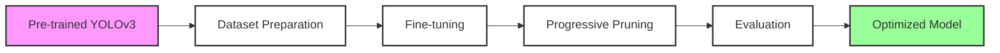
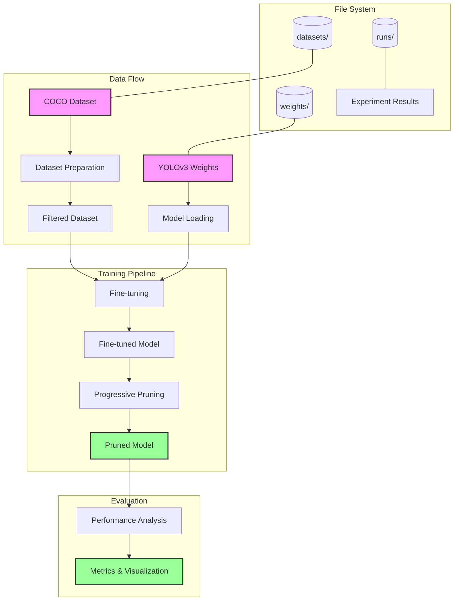

# YOLOv3 Pruning Pipeline

<div align="center">

[](https://www.python.org/downloads/release/python-380/)
[](https://pytorch.org/)
[](https://opensource.org/licenses/MIT)
[](https://github.com/psf/black)

### Pipeline Overview



*A comprehensive pipeline for optimizing YOLOv3 models through fine-tuning and pruning*

</div>

## Overview

This project provides an end-to-end pipeline for optimizing YOLOv3 models, specifically focused on person detection. It combines state-of-the-art techniques in model pruning and fine-tuning to create efficient, production-ready models.

### Key Features

- **Specialized Person Detection**: Fine-tuned specifically for human detection tasks
- **Model Pruning**: Intelligent weight pruning using L1-norm based filter pruning
- **Performance Tracking**: Comprehensive metrics and visualization tools
- **Automated Pipeline**: End-to-end automation from dataset preparation to evaluation
- **Cross-Platform**: Works on Windows, Linux, and macOS
- **Detailed Analytics**: Performance comparison across different pruning stages

## 🏗️ Architecture



The pipeline consists of four main stages:
1. **Dataset Preparation**: Downloads and filters COCO dataset for person detection
2. **Fine-tuning**: Optimizes YOLOv3 for person detection
3. **Progressive Pruning**: Reduces model size while maintaining accuracy
4. **Evaluation**: Comprehensive performance analysis

## Technical Details

### Model Architecture
- Base Model: [YOLOv3](https://pjreddie.com/darknet/yolo/) (You Only Look Once version 3)
- Backbone: Darknet-53
- Input Resolution: 416×416 pixels
- Pre-trained on: MS COCO dataset

### Optimization Process

### Progressive Pruning Process


1. **Fine-tuning**
   - Person-specific dataset preparation
   - Learning rate scheduling
   - Class-focused optimization

2. **Pruning Strategy**
   - L1-norm based filter pruning
   - Progressive pruning with performance monitoring
   - Adaptive pruning ratios

## Getting Started

### Prerequisites

- Python 3.8 or higher
- CUDA-compatible GPU (recommended)
- Git
- wget (for Unix systems)
- ~20GB disk space

### Quick Start

1. **Clone the repository**:
```bash
git clone https://github.com/yourusername/yolov3-pruning.git
cd yolov3-pruning
```

2. **Setup environment**:
```bash
python setup_env.py
```

3. **Run the pipeline**:

On Unix systems:
```bash
./run_pipeline.sh --output-dir ./runs
```

On Windows:
```bash
python run_pipeline.py --output-dir ./runs
```

### Results Visualization

### Real-time Monitoring

```mermaid
graph TD
    subgraph Training Metrics
        A[Loss Curves] --> B[Learning Rate]
        B --> C[Validation mAP]
    end
    
    subgraph Resource Usage
        D[GPU Memory] --> E[CPU Usage]
        E --> F[Disk I/O]
    end
    
    subgraph Model Analytics
        G[Model Size] --> H[FLOPs]
        H --> I[Inference Time]
    end
    
    subgraph Logging
        J[Training Log] --> K[Error Reports]
        K --> L[Performance Stats]
    end
    
    style A fill:#ccf,stroke:#333,stroke-width:2px
    style D fill:#fcf,stroke:#333,stroke-width:2px
    style G fill:#cfc,stroke:#333,stroke-width:2px
    style J fill:#fcc,stroke:#333,stroke-width:2px
```



Example results after optimization:
- Model size reduction: Up to 70%
- Inference speed improvement: Up to 2x
- Minimal accuracy loss: < 1% mAP drop

## Project Structure

```
yolov3-pruning/
├── data/                 # Dataset configuration
├── utils/                # Utility functions
├── docs/                 # Documentation
│   └── images/          # Architecture diagrams
├── download_weights.py   # YOLOv3 weights downloader
├── download_dataset.py   # Dataset preparation
├── finetune.py          # Model fine-tuning
├── prune.py             # Model pruning
├── run_pipeline.py      # Python pipeline script
└── run_pipeline.sh      # Shell pipeline script
```

## Advanced Configuration

### Pipeline Arguments

| Argument | Description | Default | Example |
|----------|-------------|---------|---------|
| --output-dir | Results directory | ./runs | ./experiments |
| --epochs | Training epochs | 20 | 50 |
| --batch-size | Batch size | 32 | 64 |
| --initial-ratio | Initial pruning | 0.2 | 0.3 |
| --max-ratio | Maximum pruning | 0.8 | 0.7 |
| --prune-steps | Pruning steps | 4 | 5 |

### Output Structure

```
runs/
├── finetune/
│   ├── best.pt           # Best model
│   └── results.txt       # Metrics
├── prune/
│   ├── best.pt          # Pruned model
│   └── results.txt      # Metrics
└── pipeline.log         # Detailed log
```

## Contributing

We welcome contributions! See our [Contributing Guide](CONTRIBUTING.md) for details.

1. Fork the repository
2. Create a feature branch
3. Commit your changes
4. Push to the branch
5. Open a pull request

## References

1. [YOLOv3: An Incremental Improvement](https://arxiv.org/abs/1804.02767)
2. [Learning Efficient Convolutional Networks](https://arxiv.org/abs/1708.06519)
3. [COCO Dataset](https://cocodataset.org/)
4. [Pruning Filters for Efficient ConvNets](https://arxiv.org/abs/1608.08710)

## License

This project is licensed under the MIT License - see the [LICENSE](LICENSE) file for details.

## Acknowledgments

- [YOLOv3](https://pjreddie.com/darknet/yolo/) by Joseph Redmon
- [PyTorch](https://pytorch.org/) team
- [COCO dataset](https://cocodataset.org/) team

---

<div align="center">
<p>Made with ❤️ for the Computer Vision community</p>

<a href="https://github.com/yourusername/yolov3-pruning/stargazers">⭐ Star us on GitHub</a> |
<a href="https://github.com/yourusername/yolov3-pruning/issues">🐛 Report Bug</a> |
<a href="https://github.com/yourusername/yolov3-pruning/issues">✨ Request Feature</a>
</div>
